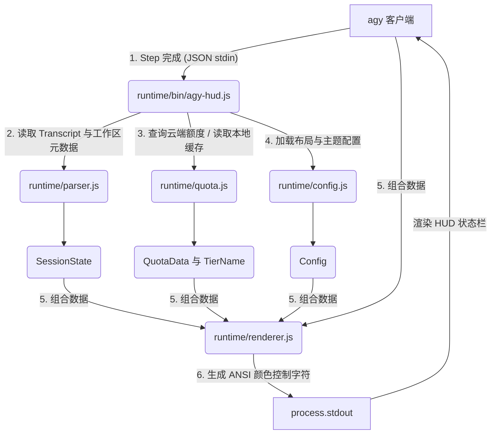

# 系统架构与数据流

本文档详细介绍了 `agy-hud` 的软件架构，阐释了数据如何从 Antigravity CLI (`agy`) 客户端流入 HUD 插件，并最终生成实时的状态栏。

## 高层数据流

下图展示了 `agy` CLI 如何调用状态栏指令、如何通过标准输入传递会话细节，以及 `agy-hud` 如何将其与工作区及云端额度数据聚合。



---

## 1. 输入：Stdin 数据载荷

当 `agy` 完成一个对话 Step 时，它会启动配置的状态栏指令，并通过标准输入（stdin）传入一个 JSON 数据载荷。

### 典型的 Stdin 结构
```json
{
  "conversation_id": "79e8894f-4bb3-4a81-84f0-b3b202e784a8",
  "transcript_path": "/Users/c/.gemini/antigravity-cli/brain/79e8894f-4bb3-4a81-84f0-b3b202e784a8/.system_generated/logs/transcript.jsonl",
  "task_count": 0,
  "model": {
    "id": "gemini-3.5-flash-low",
    "display_name": "Gemini 3.5 Flash (Low)"
  },
  "context_window": {
    "total_input_tokens": 14758,
    "total_output_tokens": 4820,
    "context_window_size": 1048576,
    "used_percentage": 1.4,
    "current_usage": {
      "input_tokens": 14758,
      "output_tokens": 4820,
      "cache_read_input_tokens": 8192
    }
  }
}
```

- **`conversation_id`**：若 stdin 中缺失 `transcript_path`，可用作解析会话目录的备用凭据。
- **`model`**：提供当前正在运行的模型 ID 与显示名称。
- **`context_window`**：提供 Token 计数与上下文窗口容量上限。

---

## 2. 会话解析与元数据扫描 (`parser.js`)

[parser.js](file:///Users/c/agy-hud/runtime/parser.js) 组件负责聚合本地文件系统的细节以补全 stdin 数据。

### 历史记录日志 (Transcript) 扫描
`parser.js` 会逐行读取 `transcript_path` 处的日志：
- 将 `transcript.jsonl` 中的每一行解析为 JSON 实体。
- 提取最高的 `step_index` 作为当前的 Step 计数。
- 递归查找 JSON 实体以获取最新的 Token 占用率 (`context_window`)，用作 stdin 缺失时的兜底数据。

### Git 集成
使用 `git rev-parse --abbrev-ref HEAD`（由 `paths.js` 安全定位）以获取当前所在的分支名称。若获取失败或并非 Git 仓库，则默认降级为 `"main"`。

### 工作区元数据扫描
为了向开发者展示即时状态，`parser.js` 会扫描当前工作目录（`process.cwd()`）的如下内容：
1. **Memory 记忆文件**：按优先级搜索 `GEMINI.md` $\to$ `CLAUDE.md` $\to$ `MEMORY.md`（包括 `~/.claude/projects/<project-key>/memory/MEMORY.md` 路径下的全局项目记忆）。
2. **规则数**：统计 `.claude/rules`、`.cursor/rules`、`.github/rules` 及 `.gemini/rules` 目录下的 `.md` 规则文件总数。
3. **Git Hooks 数**：解析 Git 钩子目录，统计所有非 `.sample`、非 `.disabled` 的有效脚本数。
4. **MCP 服务数**：从 `~/.gemini/antigravity-cli/settings.json` 与 Claude Desktop 配置中，统计活动的 Model Context Protocol (MCP) 服务数量。
5. **工作目录名称**：提取当前工作目录基础文件夹名称（`path.basename(cwd)`），存为 `state.currentDir`。

---

## 3. 额度与订阅等级管理 (`quota.js` 与 `quota/` 子模块)

网络请求开销大，[quota.js](file:///Users/c/agy-hud/runtime/quota.js) 作为主入口，协调其四个专门子模块来提供高能效的 **SWR (Stale-While-Revalidate)** 机制：
- **`quota/token.js`**：跨平台令牌（Token）发现，包括 Unix 文件读取和 Windows 凭据管理器 C# 脚本直接读取（首创 5 分钟局部临时缓存）。
- **`quota/cache.js`**：缓存读写模块。引入 **Schema v3 结构**，增加 `accountEmail` 缓存以跟踪切号情况。缓存以 Token 文件来源为 key 进行哈希（`cacheKeyHash`），确保在 OAuth refresh 后依然能复用缓存，不会产生抖动。
- **`quota/cloud.js`**：云端 PA API & OIDC 客户端。执行 `fetchAvailableModels` 额度抓取、`loadCodeAssist` 订阅等级抓取，以及**首创的 Google OIDC 认证邮箱直读（`fetchAccountEmail`）**，从根本上确保多账号切号时 email 权威无误（PR #62）。
- **`quota/models.js`**：API 配额标准化与归并。由于 PA 接口每次只返回当前时间窗口绑定的额度（短期/长期交替），该模块实现了五小时与每周窗口的**历史观察数据合并（`mergeQuotaWindows`）**，并在渲染层呈现正确的单行指标。

### 核心运作逻辑：
- **快路径**：优先读取本地缓存文件 `agy-hud-quota-cache.json` 并返回。
- **后台异步进程**：若缓存过期或检测到 Token 发生轮转（Rotate），则启动 detached 后台守护进程：
  ```bash
  node runtime/quota.js --refresh
  ```
  该进程后台请求云端以异步重写缓存，决不阻塞终端交互。
- 详细逻辑请参阅：[额度抓取与缓存机制 (中文版)](file:///Users/c/agy-hud/docs/quota_and_caching_zh.md)。

---

## 4. UI 拼装渲染 (`renderer.js` 与 `renderer/` 子模块)

[renderer.js](file:///Users/c/agy-hud/runtime/renderer.js) 作为协调器，汇总 `SessionState`、`AgyData`、`Config`、`QuotaData` 与 `TierName`，并委托其三个子模块完成 ANSI 终端组装：
- **`renderer/format.js`**：提供底层 ANSI 配色指令、大数单位进位格式化（如 `83.7k`、`1.0M`）、重置时间格式化以及缓和的 Cache 抖动处理（`applyCacheSmoothing`）。
- **`renderer/lang.js`**：根据系统环境变量和配置自动判定 locale（支持 `zh`/`en`），提供统一的本地化异常诊断。
- **`renderer/quota-render.js`**：绘制模型配额柱状图和多列排版。

> [!NOTE]
> 依据 PR #61 的回滚，渲染器重新回归到紧凑大方的**单行两列对齐**设计。柱状图只反应当前的绑定额度值，彻底解决了之前多行多窗口并列导致的 vertical 屏幕占用过多问题。

- 详细规格请参阅：[渲染与布局规范 (中文版)](file:///Users/c/agy-hud/docs/rendering_and_styling_zh.md)。

---

## 5. 错误捕获与容错

`agy-hud` 遵循“静默失效”设计，确保 HUD 出现的任何内部错误绝对不会干扰用户 `agy` 的主交互：
- 全局捕获 `agy-hud.js` 中执行的任意异常。
- 将报错堆栈以 `0o600` 的安全权限写入 `<antigravity-root>/agy-hud-error.log`。
- 报错捕获后退出码强制返回 `0`，保证 `agy` 主进程流程不中断。
